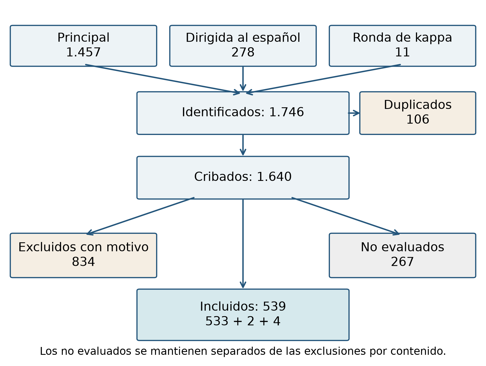

# SMS_NLP4RE

## Recursos léxico-semánticos en NLP4RE: un mapeo sistemático con atención al español

**Paquete de investigación 1.0.0 · Manuscrito v6 · Cierre documental: septiembre de 2026**

Datos, decisiones de selección, inventario de recursos y programas de reproducción del mapeo de procesamiento del lenguaje natural aplicado a la ingeniería de requisitos. El estudio caracteriza recursos, tareas, lengua de los datos, evaluación y disponibilidad declarada, con atención al español.

[Artículo en Word](manuscrito/Mapeo_Sistematico_NLP4RE_espanol_v6.docx) · [Metodología](documentacion/METODOLOGIA.md) · [Guía de datos](datos/README.md) · [Reproducir resultados](documentacion/REPRODUCIBILIDAD.md) · [Cómo citar](CITATION.cff)

### Alcance del estudio

| Unidad | Recuento | Interpretación |
| --- | ---: | --- |
| Registros identificados | 1.746 | 1.457 principales, 278 de búsqueda dirigida y 11 de la ronda de kappa |
| Duplicados | 106 | Conservan el vínculo con el registro retenido |
| Registros cribados | 1.640 | 834 excluidos, 267 no evaluables y 539 incluidos |
| Estudios del análisis principal | 533 | Denominador de tareas, familias, evaluación y distribución anual |
| Recursos concretos de RQ3 | 90 | Usados en 196 estudios del flujo principal |
| Pares únicos estudio–recurso | 318 | Usos, excluidas las menciones sin aplicación |
| Estudios con datos en español | 8 | Cuatro principales, dos dirigidos y dos de la ronda de kappa |



**Alcance de la reproducción.** Los programas recalculan la síntesis a partir de las tablas entregadas. No repiten la búsqueda histórica, la extracción mediante modelos de lenguaje ni una revisión humana. Las etiquetas «verificada» indican la comprobación documental descrita en los datos; no acreditan validación humana independiente. Consulte las [limitaciones](documentacion/LIMITACIONES.md).

### Qué contiene este repositorio

```text
SMS_NLP4RE/
├── datos/                 Selección, extracción canónica, RQ3 y auditoría
│   └── versiones_previas/ Instantáneas conservadas para trazabilidad
├── resultados/            Agregaciones JSON, tablas CSV y validación
├── figuras/               Cinco figuras en PNG y SVG
├── scripts/               Normalización, validación, síntesis y figuras
├── documentacion/         Método, diccionario, procedencia y limitaciones
├── manuscrito/            Artículo v6 en Word y fuente de texto
├── referencias/           Bibliografía y fuentes registradas en Word
├── CITATION.cff           Metadatos de citación del suplemento
├── CHANGELOG.md           Historial de versiones
└── MANIFEST.sha256        Comprobación de integridad de los archivos
```

La carpeta local `evidencia_local/` conserva los textos utilizados en la verificación y queda excluida de Git. Su índice público identifica la base textual y su huella digital, sin redistribuir los textos íntegros. Los dictámenes y las respuestas editoriales permanecen en el paquete de trabajo del autor.

### Reproducción rápida

Requiere Python 3.12. Para validar datos y regenerar tablas, basta la biblioteca estándar:

```bash
python scripts/reproducir.py --sin-figuras
```

Para regenerar también las figuras:

```bash
python -m venv .venv
source .venv/bin/activate
python -m pip install -r requirements.txt
python scripts/reproducir.py
```

En Windows, active el entorno con `.venv\Scripts\Activate.ps1`. Los resultados se escriben dentro del repositorio. La comparación con la referencia del artículo debe finalizar sin diferencias. Consulte [reproducción y verificaciones](documentacion/REPRODUCIBILIDAD.md).

### Consultar y reutilizar los datos

- Comience por `datos/extraccion/estudios_incluidos.csv`: es la extracción canónica del paquete.
- Use `estado`, no `decision_final`, para contar la selección definitiva.
- Para RQ3, filtre `cuenta_como_uso_rq3 == True`; las restantes filas conservan menciones y categorías que no forman parte de los 318 usos.
- Los porcentajes de familias, métricas y conjuntos de evaluación son multietiqueta: pueden sumar más del 100 %.
- Mantenga separados el idioma del artículo y la lengua de los requisitos procesados.

El [diccionario de campos](documentacion/DICCIONARIO_DATOS.md) explica los indicadores. El [catálogo de archivos](documentacion/CATALOGO_DATOS.csv) y el [esquema](documentacion/esquema_datos.json) permiten localizar cada tabla y sus columnas.

### Citación y disponibilidad

Autor del paquete: **Kenji Kawaida Villegas**. La versión local preparada es **1.0.0**, vinculada al manuscrito **v6**. No se asigna un DOI ni una dirección pública ficticia. Al publicar, se registrarán en `CITATION.cff` la dirección real del repositorio, la fecha de publicación y el DOI de la versión archivada.

Citación provisional: Kawaida Villegas, K. (2026). *SMS_NLP4RE: datos y materiales del mapeo sistemático de recursos léxico-semánticos en NLP4RE* (versión 1.0.0) [Conjunto de datos y programas]. Paquete local asociado al manuscrito v6.

Los programas propios se distribuyen bajo MIT. La documentación original y las aportaciones propias a los datos se ofrecen bajo CC BY 4.0, con las exclusiones indicadas en [LICENSE.md](LICENSE.md). Las citas, los metadatos externos, los recursos estudiados y el manuscrito tienen el alcance de derechos indicado allí.

Para proponer una corrección, siga [CONTRIBUTING.md](CONTRIBUTING.md) e identifique el registro, campo y evidencia. Las correcciones deben conservar trazabilidad y no transformar comprobaciones automáticas en declaraciones de revisión humana.

### English overview

This repository accompanies a systematic mapping of lexical-semantic resources in natural language processing for requirements engineering, with a focus on Spanish. It contains screening decisions, study-level extraction, a resource inventory, audit records, and scripts for reproducing aggregate results and five figures. Main analyses cover 533 studies; 539 are included across all streams. The package supports computational checking of the supplied extraction, not a rerun of the historical search or independent human validation of all decisions.
