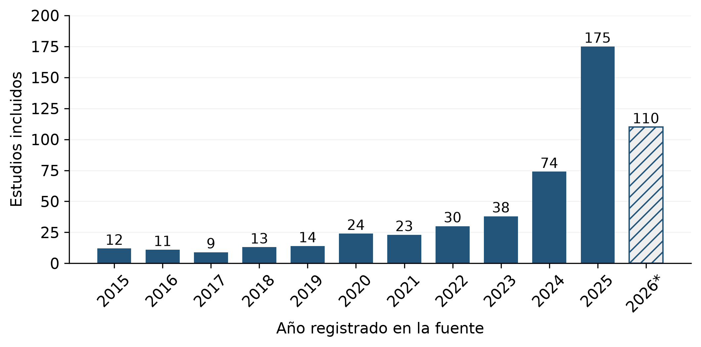
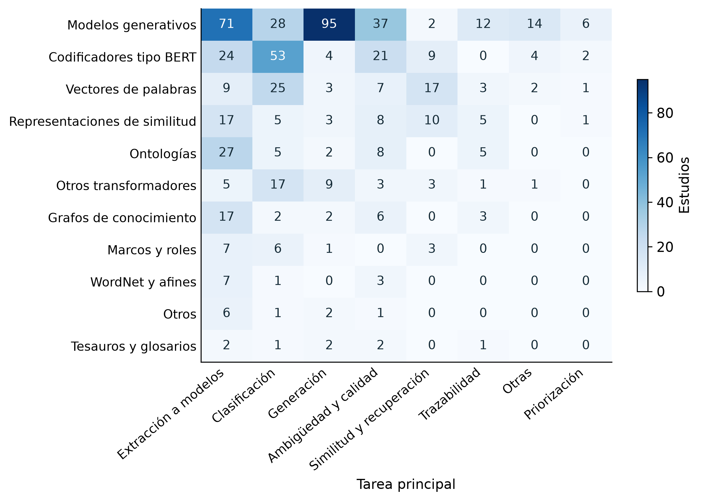
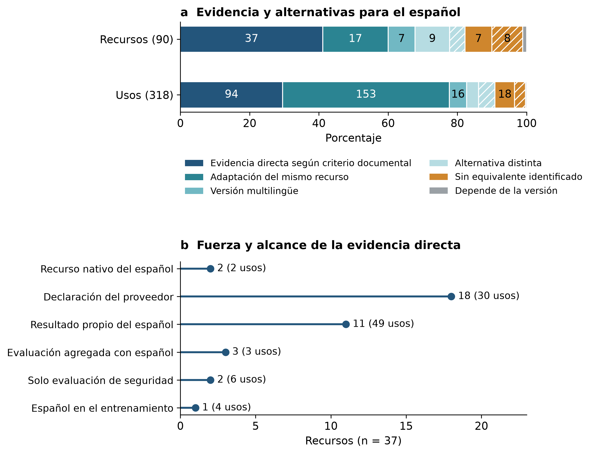
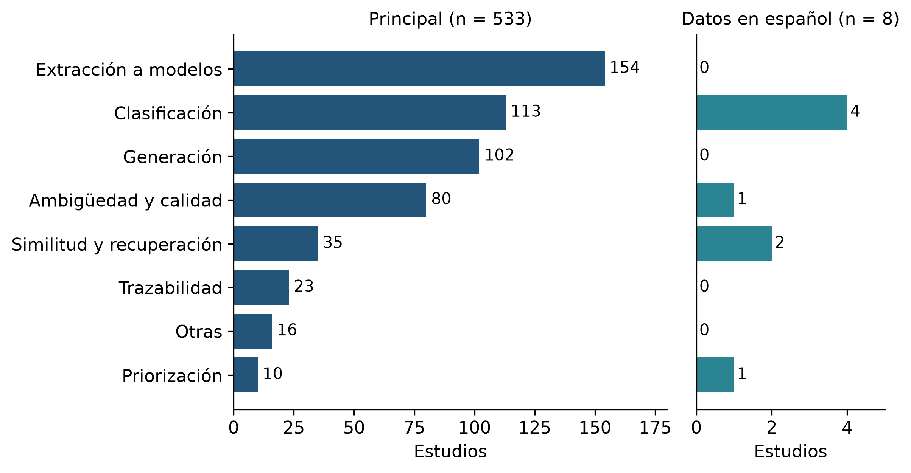

# Recursos léxico-semánticos en NLP4RE: un mapeo sistemático con atención al español

## Resumen

El procesamiento de lenguaje natural aplicado a la ingeniería de requisitos (NLP4RE) utiliza recursos léxicos, representaciones vectoriales y modelos de lenguaje para analizar documentos de requisitos. Este estudio caracteriza la evidencia publicada según los recursos empleados, las tareas abordadas, la lengua de los datos, la evaluación y la disponibilidad declarada, con atención al español. Se realizó un mapeo sobre registros de OpenAlex de 2015–2026, con búsqueda principal en julio de 2026 y revisión documental hasta septiembre. La selección asistida por un modelo de lenguaje reunió 1.746 registros de tres flujos; tras retirar 106 duplicados, se excluyeron 834, quedaron 267 sin información suficiente y se incluyeron 539. Los análisis principales describen 533 estudios. Predominan las familias de modelos generativos, presentes en 265 estudios, y la extracción a modelos u ontologías como tarea principal, con 154. Se identificaron 90 recursos concretos en 196 estudios: 37 presentan evidencia documental directa de español, de fuerza heterogénea, y otros 37 tienen una adaptación, versión multilingüe o alternativa identificada. Ocho incluidos de los tres flujos declaran datos en español y abarcan clasificación, similitud, priorización y ambigüedad. La evidencia permite una caracterización documental y una estimación condicionada al inventario identificado; no demuestra ausencia de investigación ni transferencia de rendimiento entre idiomas. La automatización, la cobertura parcial del texto completo y la falta de validación humana global limitan las inferencias. Se plantea evaluar recursos y métodos con requisitos españoles de distintos proyectos, documentando procedencia, anotación y condiciones de reutilización.

**Palabras clave:** ingeniería de requisitos, procesamiento de lenguaje natural, recursos léxico-semánticos, español, mapeo sistemático.

## Abstract

Natural language processing for requirements engineering (NLP4RE) uses lexical resources, vector representations, and language models to analyse requirements documents. This study characterizes published evidence by resources, tasks, data language, evaluation, and declared availability, with a focus on Spanish. A systematic mapping was conducted using OpenAlex records for 2015–2026, with the main search in July 2026 and documentary examination through September. Language-model-assisted selection gathered 1,746 records from three streams. After removing 106 duplicates, 834 records were excluded, 267 lacked sufficient information, and 539 were included. Main analyses describe 533 studies. Generative language models are the most frequently identified family, appearing in 265 studies, while extraction into models or ontologies is the most frequent primary task, with 154 studies. Ninety concrete resources were identified in 196 studies: 37 have direct documentary evidence concerning Spanish, with heterogeneous evidential strength, and another 37 have an identified adaptation, multilingual version, or alternative. Eight included studies across the three streams explicitly analyse Spanish data, covering classification, similarity, prioritization, and ambiguity. The findings support documentary characterization and an estimate conditional on the identified inventory; they establish neither an absence of research nor cross-language performance transfer. Automated decisions, limited full-text coverage, and the lack of global human validation constrain inference. Future evaluations should use Spanish requirements from different projects and document data provenance, annotation, and reuse conditions.

**Keywords:** requirements engineering, natural language processing, lexical-semantic resources, Spanish, systematic mapping.

## 1. Introducción

La ingeniería de requisitos, RE por *requirements engineering*, utiliza especificaciones, historias de usuario y otros documentos en lenguaje natural para expresar necesidades y restricciones de los sistemas. El procesamiento de lenguaje natural, NLP por *natural language processing*, apoya su clasificación, revisión de calidad, comparación y transformación. NLP4RE designa la aplicación de estas técnicas a las actividades de ingeniería de requisitos.

Los recursos que sustentan esas aplicaciones representan información diferente. WordNet organiza sentidos y relaciones léxicas [@Mil95]; FrameNet describe marcos semánticos y sus participantes [@Bak98]. Las representaciones vectoriales, o *embeddings*, abarcan modelos de palabras y subpalabras, como fastText [@Boj17], y representaciones contextuales, como BERT [@Dev19]. Los grandes modelos de lenguaje, LLM por *large language models*, también permiten generar o transformar textos. La existencia de un recurso, su empleo en un método y su evaluación sobre un idioma son propiedades distintas.

El problema de investigación consiste en determinar qué evidencia permite relacionar esos recursos con requisitos en español. Un modelo puede documentar capacidades en español sin haber sido evaluado en ingeniería de requisitos; un artículo escrito en inglés puede procesar datos españoles; y una herramienta puede describirse sin publicar su código. Contar publicaciones o inferir la lengua de los datos a partir de la lengua del artículo no resuelve estas diferencias.

El objetivo es caracterizar los estudios de NLP4RE identificados en OpenAlex para 2015–2026 según los recursos léxico-semánticos empleados, las tareas abordadas, la lengua de los datos, la forma de evaluación y la disponibilidad declarada de código y datos; determinar, entre los recursos concretos identificados, la evidencia de soporte, adaptación o alternativa para el español; y delimitar los vacíos observados en los estudios incluidos. La caracterización se basa en títulos, resúmenes y, cuando están disponibles, fragmentos de texto completo, con cobertura explícita para cada dimensión.

La contribución es documental: organiza atributos que suelen confundirse y relaciona el uso de un recurso con la tarea y la evidencia lingüística disponible. El trabajo no presenta una herramienta nueva ni compara experimentalmente el rendimiento de las soluciones. Su utilidad consiste en fundamentar la selección de candidatos para nuevas evaluaciones, sin convertir una disponibilidad declarada en una garantía de eficacia.

## 2. Antecedentes y preguntas de investigación

Los mapeos sistemáticos estructuran un área mediante categorías y relaciones entre publicaciones [@Pet08;Pet15]. El mapeo de Zhao y colaboradores organiza técnicas, herramientas y recursos de NLP4RE [@Zha21]. Este estudio adopta esa distinción y se concentra en la relación entre recursos e idioma de los requisitos. Los recuentos no se comparan como crecimiento frente a otros mapeos, porque cambian las búsquedas, los períodos y la elegibilidad.

La investigación en español cuenta con antecedentes verificables. Guzmán Luna y colaboradores abordan errores y desambiguación de requisitos [@Guz15]; los estudios de clasificación examinan fastText y BETO [@Lim23b]; y Pérez y colaboradores comparan modelos para similitud entre escenarios [@Per25]. BETO [@Can23] y MarIA [@Gut22] aportan recursos generales del español. Su disponibilidad no demuestra por sí misma validación en documentos de requisitos ni elimina la necesidad de datos de evaluación específicos.

Las preguntas de la tabla 1 articulan el objetivo con los resultados. La proporción de recursos de RQ3 utiliza unidades de recurso; la presencia del español en RQ4 utiliza estudios con evidencia de la lengua de los datos. Esos denominadores se mantienen separados.

**Tabla 1**

*Preguntas de investigación*

| Código | Pregunta |
| --- | --- |
| RQ1 | ¿Qué recursos léxico-semánticos se han aplicado a la ingeniería de requisitos de software? |
| RQ2 | ¿Para qué tareas de ingeniería de requisitos se emplean? |
| RQ3 | ¿Qué proporción de los recursos identificados dispone de evidencia de soporte del español o de una adaptación, versión multilingüe o alternativa? |
| RQ4 | ¿Qué recursos y aplicaciones se han documentado específicamente para requisitos en español y qué cubren? |
| RQ5 | ¿Qué vacíos se observan en la intersección entre recursos léxico-semánticos, español y requisitos de software? |
| RQ6 | ¿Qué recursos y métodos son candidatos para transferirse al español y bajo qué condiciones? |

*Nota.* RQ significa pregunta de investigación. Las precisiones de RQ3, RQ5 y RQ6 delimitan disponibilidad documental, cobertura observada y transferencia potencial.

## 3. Método

### 3.1 Diseño y unidades de análisis

Se realizó un mapeo sistemático descriptivo y analítico siguiendo las etapas de búsqueda, selección, extracción y síntesis [@Pet15]. La revisión documental fue asistida por un modelo de lenguaje y por comprobaciones en código. Se distingue esa automatización de la evaluación humana, disponible únicamente para un ejercicio anterior sobre 18 registros españoles.

La unidad recuperada es el registro bibliográfico. Una publicación es un documento identificable, mientras que un estudio puede tener varios informes. En los resultados se utiliza «estudio incluido» para el registro conservado tras la deduplicación; la vinculación residual entre informes constituye una limitación. Un recurso es un artefacto lingüístico, un modelo o una estructura de conocimiento utilizada por el método. Los conjuntos de datos y las herramientas se describen por separado.

Se considera léxico-semántico el recurso que representa palabras, sentidos, relaciones conceptuales o significado contextual. La similitud es una operación o tarea, no necesariamente un recurso identificable. La sola mención en los antecedentes no acredita uso. Bolsa de palabras y TF-IDF pueden registrarse como comparadores, pero su empleo aislado no satisface el criterio léxico-semántico adoptado.

**Tabla 2**

*Dimensiones de caracterización y criterios de interpretación*

| Dimensión | Información extraída | Interpretación |
| --- | --- | --- |
| Recurso | Nombre, familia, rol y versión cuando se especifica | Admite varios recursos; diferencia uso de mención y familia de versión. |
| Tarea | Principal y secundarias | La principal corresponde al propósito del estudio; la generación auxiliar no sustituye la tarea evaluada. |
| Lengua de los datos | Español, inglés, multilingüe, otra o no declarada | No se deduce del idioma del artículo; el origen nativo, traducido o sintético se describe cuando consta. |
| Evaluación | Tipo, datos, métricas o indicadores y comparación con una referencia | Describe el diseño declarado; no equivale a una evaluación de calidad ni a comparar resultados numéricos. |
| Disponibilidad | Declaración de código o datos; atributos del recurso | Separa acceso, licencia, evidencia lingüística y alternativa de adaptación. |
| Evidencia | Texto utilizado, cita, comprobación y procedencia | Una cita localizada acredita presencia textual, no validación humana de la interpretación. |

*Nota.* Los campos no informados se conservan explícitamente. La extracción cubre todos los incluidos, pero la completitud de cada dimensión depende del texto disponible.

### 3.2 Fuentes, consultas y período

La fuente principal fue OpenAlex, índice abierto de literatura científica [@Pri22]. No representa una consulta directa a Scopus, Web of Science, IEEE Xplore o ACM Digital Library. El registro de procedencia sitúa la búsqueda principal el 15 de julio de 2026 y conserva 1.457 identificadores únicos. Esa fecha se toma de la documentación de la ejecución; no se reconstruyó mediante una nueva descarga histórica.

La cadena principal combina términos de requisitos con recursos y representaciones semánticas. Se declaró su aplicación al campo *title_and_abstract.search* del punto de acceso */works*:

("requirements engineering" OR "software requirements" OR "requirements specification" OR "natural language requirements") AND ("WordNet" OR "word embedding" OR "semantic similarity" OR "ontology" OR "thesaurus" OR "lexical" OR "FrameNet" OR "knowledge graph" OR "word sense" OR "semantic role" OR "BERT" OR "language model" OR "semantic")

Los filtros declarados fueron fechas de publicación entre el 1 de enero de 2015 y el 31 de diciembre de 2026 y tipos *article* o *book-chapter*, sin filtro de idioma, área o acceso abierto. La fecha de ejecución limita la cobertura efectiva de 2026, que se trata como año parcial. La ventana permite examinar evidencia anterior y posterior a la expansión reciente de modelos preentrenados; los antecedentes fundacionales anteriores a 2015 cumplen una función conceptual.

La búsqueda dirigida al español, reejecutada el 27 de septiembre de 2026, aportó 278 registros. Su cadena fue: ("ingeniería de requisitos" OR "requisitos de software" OR "requisitos no funcionales" OR "especificación de requisitos" OR "Spanish requirements" OR "requirements in Spanish" OR "Spanish software requirements" OR "requisitos en español"). Se incorporaron además 11 registros de la ronda de kappa no presentes en los otros flujos. Las proporciones principales utilizan el primer flujo; los otros dos amplían el examen del español y se identifican en cada tabla.

### 3.3 Elegibilidad y deduplicación

Se incluyeron estudios primarios que aplican NLP o aprendizaje automático a requisitos de software (CI1) y utilizan o construyen un recurso léxico-semántico (CI2). El análisis del español exige evidencia de la lengua de los datos procesados. Se admitieron publicaciones en español, inglés y portugués. El criterio sobre el dominio se refiere al objeto de estudio: investigar software médico o jurídico no constituye por sí mismo motivo de exclusión.

Los motivos de exclusión distinguen requisitos de otro dominio (CE1), ausencia del recurso requerido (CE2), documento ajeno al tipo primario requerido (CE3), idioma no admitido (CE4), duplicación o versión redundante (CE5) y estudio secundario (CE6). La revisión por pares no puede acreditarse únicamente por el tipo de OpenAlex o la existencia de una sede; la condición editorial no comprobada se mantiene como amenaza a la validez. Las revisiones se utilizan como antecedentes, sin sumarlas a los estudios primarios.

La deduplicación comparó identificadores, DOI, títulos y versiones relacionadas. La revisión añadió alertas por alta similitud entre resúmenes y coincidencia de autoría. Se retiraron 106 registros conservando el vínculo con la versión retenida. Los títulos genéricos y los resúmenes incompatibles se trataron como problemas de identidad documental, sin asumir automáticamente duplicación. La verificación automatizada de identidad detectó cinco asociaciones incompatibles entre título y resumen; se retiró el resumen ajeno y se reconsideró el registro con la evidencia disponible.

### 3.4 Cribado y recuperación de texto

La selección global volvió a examinar los registros de los tres flujos, incluidos los descartados por los filtros léxicos iniciales. El procedimiento identificado en la trazabilidad como *claude-sonnet-5* aplicó una consigna fija de elegibilidad y extracción, con pasadas adicionales en los casos límite. Las consignas evolucionaron de *cribado-extraccion-v1.2* a las versiones v1.4 y v1.5 al incorporar fragmentos de texto completo. Las coincidencias entre pasadas reflejan estabilidad del procedimiento, no acuerdo entre personas independientes.

Se buscaron textos completos de 343 candidatos mediante DOI, fuentes de acceso abierto y búsquedas por título. Se recuperaron 35, de los cuales el procedimiento seleccionó fragmentos de método o del comienzo del documento para reconsiderar la elegibilidad. Entre los 539 incluidos, 488 decisiones se basan en título y resumen, 36 solo en título y 15 en fragmentos de texto completo. No se presenta este proceso como lectura íntegra de todos los artículos.

La recuperación se cerró el 27 de septiembre de 2026. Quedaron 267 registros sin información suficiente: 244 principales y 23 de la búsqueda dirigida. Se documentan intentos, resultado y destino. Estos registros no integran la síntesis ni los denominadores de estudios incluidos y se mantienen separados de las exclusiones por contenido. No localizar una copia por las vías consultadas no demuestra que no exista acceso por otras vías.

### 3.5 Extracción y construcción de RQ3

La extracción se aplicó a los 539 incluidos y registra cada valor junto con su cita y el texto utilizado. La comprobación normaliza entidades HTML, marcado, codificación y caracteres antes de localizar los pasajes. Se verificaron 2.653 citas de los campos originales de selección y extracción, sin contar 27 citas de recursos solo mencionados. Se revisaron por separado las citas de la nueva dimensión de evaluación y se corrigieron paráfrasis, elipsis y marcado matemático sin cambiar las decisiones de inclusión. Una evaluación cuyo diseño no podía determinarse se clasificó como «no consta».

Para RQ3 se normalizaron nombres compuestos y variantes de un recurso. Los tamaños y variantes de una misma versión se agrupan; las familias sin versión y los algoritmos genéricos se mantienen aparte. Un uso corresponde a un par estudio–unidad, contado una sola vez por estudio. Las menciones bibliográficas se excluyen del recuento. El suplemento permite volver del total agregado al pasaje de cada registro.

El inventario separa evidencia directa de español, soporte no documentado, soporte desconocido y casos dependientes de la versión. La evidencia directa conserva el criterio documental amplio de la extracción: recurso nativo, declaración del proveedor, evaluación que incluye español o presencia del idioma en el entrenamiento. Esas evidencias se desglosan por fuerza; no se interpretan como equivalentes a eficacia demostrada. También se distingue una adaptación del mismo recurso, una versión multilingüe y una alternativa funcional diferente.

Los atributos se contrastaron de forma automatizada con artículos, informes técnicos, fichas oficiales, documentación y licencias. De las 90 unidades concretas, 25 se apoyan en fuentes descargadas, 51 combinan esas fuentes con fragmentos indexados de páginas oficiales, 13 se apoyan solo en fragmentos y en una no consta la modalidad. Tres unidades mantienen soporte desconocido por falta de verificación. Las fuentes, citas y fechas figuran por atributo en el inventario.

### 3.6 Consistencia y alcance de la validación

Se conciliaron los identificadores entre selección, extracción, pendientes y pares de recursos. Las 276 cifras del paquete de entrada fueron recalculadas independientemente y coincidieron; los ajustes posteriores de evaluación quedaron registrados y sus tablas se regeneraron. Esta verificación acredita consistencia interna, sin reemplazar la revisión semántica ni la validación humana de las decisiones.

La ronda humana previa contiene 18 pares de decisiones: 16 inclusiones coincidentes, una exclusión coincidente y un desacuerdo. El acuerdo observado es 17/18 = 0,9444 y κ = 0,640 [@Coh60]. El predominio de inclusiones condiciona la relación entre ambas medidas [@Fei90]. Ese ejercicio se restringe al subcorpus y a su protocolo histórico; no se extrapola al cribado global. Las lecturas asistidas posteriores y el acuerdo entre pasadas automáticas no se presentan como nuevas rondas humanas.

## 4. Resultados

### 4.1 Selección y denominadores

La selección conserva 539 estudios de los 1.746 registros identificados. La tabla 3 y la figura 1 muestran el destino de todos los registros. Los análisis de distribución utilizan los 533 incluidos principales; los seis de otros flujos se incorporan al examen dirigido del español, con procedencia explícita.

**Tabla 3**

*Selección por flujo de procedencia*

| Etapa | Principal | Dirigida | Ronda de kappa | Total |
| --- | --- | --- | --- | --- |
| Identificados | 1.457 | 278 | 11 | 1.746 |
| Duplicados retirados | 89 | 16 | 1 | 106 |
| Cribados | 1.368 | 262 | 10 | 1.640 |
| Excluidos con motivo | 591 | 237 | 6 | 834 |
| Sin información suficiente | 244 | 23 | 0 | 267 |
| Incluidos | 533 | 2 | 4 | 539 |

*Nota.* Identificados menos duplicados equivale a cribados; cribados equivale a excluidos, no evaluados e incluidos. Los motivos globales de exclusión son CI1 no cumplido (479), CE1 (145), CE2 (60), CE3 (88), CE4 (9) y CE6 (53). CE5 corresponde a los duplicados retirados.

**Figura 1**

*Flujo de selección de los registros*

*Nota.* Elaboración a partir de las decisiones por registro. Se informa por separado lo no evaluado; el gráfico no implica lectura de texto completo para toda la selección.

En el flujo principal, 1.124 de 1.368 registros cribados tienen decisión de inclusión o exclusión (82,2 %). Los 244 restantes limitan la cobertura. Si todos resultaran elegibles, el número principal ascendería de 533 a 777; este intervalo de escenarios ilustra la incertidumbre de selección, sin estimar cuántos deberían incluirse.

### 4.2 Distribución temporal

La figura 2 muestra 12 incluidos en 2015, 38 en 2023, 74 en 2024 y 175 en 2025. Los 110 de 2026 corresponden al corte parcial. La concentración reciente describe la búsqueda y la selección aplicadas; no prueba por sí misma crecimiento de todo el campo ni una sustitución causal de enfoques anteriores.

**Figura 2**

*Estudios principales incluidos por año registrado, 2015–2026*

*Nota.* n = 533. El asterisco y el rayado identifican 2026 como año parcial. Se conserva el año del registro bibliográfico para la distribución; puede diferir del año del volumen utilizado en una referencia.

### 4.3 Recursos y tareas de los estudios (RQ1 y RQ2)

Las familias más frecuentes son modelos generativos (265 estudios; 49,7 %), codificadores tipo BERT (117; 22,0 %) y vectores de palabras (67; 12,6 %). Se registran además ontologías en 47, grafos de conocimiento en 30, marcos o roles en 17, WordNet y afines en 11 y tesauros o glosarios en ocho. Las categorías de representaciones de similitud, otros transformadores y otros recursos completan el esquema; se informan como familias operacionales, sin tratarlas como recursos concretos intercambiables.

La extracción a modelos u ontologías es la tarea principal más frecuente (154; 28,9 %), seguida de clasificación (113; 21,2 %), generación (102; 19,1 %), ambigüedad y calidad (80; 15,0 %), similitud y recuperación (35; 6,6 %), trazabilidad (23; 4,3 %), otras (16; 3,0 %) y priorización (10; 1,9 %). Cada estudio tiene una tarea principal; las secundarias se conservan en la extracción.

La figura 3 relaciona tareas con todas las familias utilizadas. A diferencia de una etiqueta asignada por primera coincidencia, este cruce admite varios recursos por estudio. Permite localizar combinaciones para un examen posterior, sin inferir eficacia de la frecuencia observada.

**Figura 3**

*Relación entre familias de recursos y tarea principal*

*Nota.* n = 533 estudios. Un estudio puede ocupar varias filas, pero una sola columna de tarea principal. Cada celda representa estudios, no menciones. Se incluyen las ocho tareas, también trazabilidad, priorización y otras.

### 4.4 Evaluación y completitud de la caracterización

La tabla 4 diferencia evaluación descrita, falta de declaración y diseño no determinable. Después de corregir las citas, 441 estudios principales cuentan con un tipo de evaluación descrito y un pasaje localizado. No corresponde sumar a ese total los 50 clasificados sin evaluación declarada.

**Tabla 4**

*Tipo de evaluación declarado en el flujo principal*

| Tipo | Estudios | Porcentaje de 533 |
| --- | --- | --- |
| Experimento con métricas | 306 | 57,4 % |
| Caso de estudio o demostración | 96 | 18,0 % |
| Evaluación con personas | 39 | 7,3 % |
| Sin evaluación declarada en el texto analizado | 50 | 9,4 % |
| No consta el tipo de evaluación | 42 | 7,9 % |
| Total | 533 | 100,0 % |

*Nota.* La clasificación es automática y se basa en el texto disponible. «Sin evaluación declarada» no acredita ausencia de evaluación en el artículo íntegro. Una categoría principal no excluye tipos secundarios.

En 249 estudios se identifica algún conjunto de evaluación; 173 describen datos propios sin nombre. Entre los conjuntos identificados destacan PROMISE y sus variantes (31) y PURE (13). En 264 aparecen métricas o indicadores con cita localizada, con F1 en 93, exactitud en 78 y precisión y exhaustividad en 63 cada una. Estas categorías pueden coexistir. Los 282 registros con comparación declarada abarcan referencias o métodos; no todos constituyen comparación experimental entre algoritmos equivalentes. No se extrajeron sistemáticamente resultados numéricos comparables.

La completitud es desigual: solo 34 estudios principales declaran la lengua de los datos, cuatro de ellos español; los 499 restantes no permiten inferirla. Solo 23 declaran código o datos públicos. La disponibilidad no declarada no se equipara a inexistencia de acceso, y la presencia de un enlace tampoco acredita ejecutabilidad o licencia suficiente.

### 4.5 Recursos identificables y evidencia del español (RQ3)

Se identificaron 90 unidades concretas en 196 de los 533 estudios principales (36,8 %), que reúnen 318 pares estudio–recurso. De los restantes, 17 solo nombran algoritmos de incrustación, 30 solo familias sin versión y 290 solo clases genéricas, técnicas o herramientas. El inventario completo añade 12 familias sin versión y cuatro algoritmos, que no se incluyen en el denominador de 90.

**Tabla 5**

*Evidencia documental del español y alternativas entre las unidades concretas*

| Categoría | Recursos | Usos |
| --- | --- | --- |
| Evidencia directa según el criterio documental | 37 | 94 |
| Adaptación del mismo recurso | 17 | 153 |
| Versión multilingüe del mismo recurso | 7 | 16 |
| Alternativa distinta; soporte original no documentado | 9 | 11 |
| Alternativa distinta; soporte original desconocido | 4 | 15 |
| Sin equivalente identificado; soporte no documentado | 7 | 18 |
| Sin equivalente identificado; soporte desconocido | 8 | 10 |
| Dependiente de la versión | 1 | 1 |
| Total | 90 | 318 |

*Nota.* Un uso es un par estudio–recurso, sin duplicación interna ni simples menciones. «Desconocido» no significa ausencia. Las versiones se agrupan según la regla operacional del método y no equivalen necesariamente a un punto de control exacto del modelo.

Según el criterio documental amplio, 37 unidades tienen evidencia directa de español (41,1 %); otras 37 tienen una adaptación, versión o alternativa identificada (41,1 %). En 15 no se identificó equivalente (16,7 %) y una depende de su versión (1,1 %). La evidencia directa comprende dos recursos nativos, 18 declaraciones del proveedor, 11 evaluaciones con resultado propio del español, tres evaluaciones agregadas que incluyen ese idioma, dos evaluaciones de seguridad y un caso sustentado solo en datos de entrenamiento. La figura 4 mantiene estas evidencias separadas.

**Figura 4**

*Evidencia documental sobre el español en 90 recursos identificados y 318 usos*

*Nota.* El panel a muestra la clasificación del inventario; el rayado indica soporte desconocido. El panel b desglosa los 37 casos de evidencia directa. Sus 94 usos equivalen al 29,6 % de 318. Estos porcentajes no estiman rendimiento ni soporte de todo el campo; se refieren a recursos identificados en 196 estudios principales.

BERT concentra 84 usos. El estudio SimRE solo lo menciona como antecedente y no se cuenta como usuario de ese recurso. BETO constituye una adaptación específica para el español [@Can23], pero reemplazar un modelo requiere evaluar de nuevo el método. Los modelos multilingües de representación de oraciones ofrecen otra vía [@Rei20]. Incluso cuando un informe técnico presenta resultados en español, como el de GPT-4 [@Ope23], esa evidencia no mide automáticamente el desempeño en ingeniería de requisitos.

El inventario registra 63 recursos con pesos o datos descargables y 20 ofrecidos mediante servicios o interfaces de programación, además de otras modalidades. Acceso, licencia y soporte lingüístico se tratan como atributos diferentes. No se infiere que descargar pesos autorice cualquier uso ni que disponer de una alternativa preserve el rendimiento original.

## 5. Estudios con requisitos en español (RQ4)

Ocho incluidos de los tres flujos declaran datos en español: cuatro del principal, dos de la búsqueda dirigida y dos de la ronda de kappa. La tabla 6 relaciona cada estudio con su tarea y evidencia, evitando inferir el idioma desde el título. No se suman al conjunto otros trabajos únicamente por estar escritos en español.

**Tabla 6**

*Estudios incluidos que declaran datos en español*

| Estudio | Flujo | Tarea y evidencia |
| --- | --- | --- |
| Guzmán Luna y colaboradores [@Guz15] | Principal | Ambigüedad y errores; método léxico-semántico, sin recurso concreto identificado en la extracción. |
| Clasificación con fastText y BETO [@Lim23b] | Principal | Clasificación de requisitos españoles; distingue datos nativos y traducidos. |
| Similitud de escenarios [@Per25] | Principal | Comparación de modelos multilingües de representación de oraciones sobre escenarios españoles. |
| SimRE [@Lim25a] | Principal | Similitud en una línea de productos de sistemas de información geográfica; usa representaciones españolas y multilingües. |
| Balanceo de requisitos no funcionales [@Lim25b] | Dirigida | Clasificación; BETO y fastText, vectores SBWCE y generación auxiliar con ChatGPT; datos traducidos, nativos y sintéticos. |
| Criterios de priorización [@Lim26] | Dirigida | Priorización sobre PrioReSpa; el resumen nombra modelos preentrenados sin identificar su versión. |
| Clasificación no funcional [@Lim23a] | Ronda de kappa | Clasificación con requisitos de PROMISE traducidos al español y comparación de enfoques. |
| Clasificación automática de requisitos [@Lim23e] | Ronda de kappa | Clasificación con BETO sobre un conjunto de requisitos españoles de proyectos académicos. |

*Nota.* El artículo de balanceo apareció en línea en 2025 y pertenece al volumen de 2026; la referencia utiliza el año del volumen. Los ocho registros cumplen el protocolo aplicado, pero la selección global no ha recibido validación humana independiente.

Los recursos específicos de requisitos incluyen traducciones de PROMISE, ReSpaN y PrioReSpa, además de conjuntos propios. Se distinguen de recursos generales del idioma, como BETO y el corpus y vectores SBWCE [@Car16]. El trabajo que construye el conjunto FAIR de requisitos no funcionales [@Lim23c] aporta contexto relevante, aunque queda fuera de la selección estricta por no aplicar procesamiento NLP al texto según CI1. Esta exclusión delimita el objeto del mapeo, no niega el valor del recurso.

El trabajo de balanceo utiliza generación de requisitos sintéticos como apoyo a la clasificación. Por ello, la ausencia de generación como tarea principal entre los ocho no equivale a ausencia de modelos generativos. Igualmente, una mejor puntuación de un clasificador estadístico en un experimento no elimina el uso de recursos semánticos comparados en el mismo estudio.

El predominio del idioma no declarado impide convertir 4/533 en la prevalencia real del español en el campo. Esa fracción, 0,75 %, expresa detección explícita dentro del flujo principal; no permite clasificar los otros 529 como estudios con datos ingleses.

## 6. Discusión de vacíos y transferencia

### 6.1 Vacíos observados y alcance de la evidencia (RQ5)

Los resultados cuestionan la idea de un vacío absoluto del español. Existen trabajos de ambigüedad anteriores a la expansión de LLM, clasificación con modelos contextuales, similitud y priorización. La aportación del mapeo consiste en describir su cobertura y las condiciones de evidencia, no en justificar una ausencia predeterminada.

La figura 5 sitúa las tareas del conjunto principal y las de los ocho estudios con datos españoles. Estos últimos se distribuyen en clasificación (cuatro), similitud y recuperación (dos), priorización (uno) y ambigüedad y calidad (uno). No se detecta extracción a modelos, generación como tarea principal ni trazabilidad entre ellos. Esas tres tareas reúnen 279 registros principales, pero los conjuntos comparados tienen distintas estrategias de recuperación y no fundamentan razones de prevalencia entre idiomas.

**Figura 5**

*Tareas principales del flujo principal y de los estudios que declaran datos en español*

*Nota.* Panel izquierdo: 533 incluidos principales. Panel derecho: ocho incluidos con datos españoles de los tres flujos, cuatro de ellos también en el izquierdo. Las escalas horizontales son distintas y se indican expresamente. Los ceros describen la selección, no inexistencia de investigación.

La falta de lengua declarada y la identificación incompleta de versiones son vacíos de información distintos de un vacío temático. Tampoco el soporte documental del español equivale a validación sobre requisitos. El predominio de conjuntos propios y la ausencia de resultados comparables dificultan inferir transferencia entre proyectos, dominios e idiomas.

El contraste con Zhao y colaboradores [@Zha21] es conceptual: ambas perspectivas organizan NLP4RE, mientras este análisis explicita idioma de los datos, versión del recurso y naturaleza de la evidencia. Las diferencias de volumen no se utilizan como prueba de mejora de cobertura. El presente diseño tampoco establece las causas de la menor presencia explícita del español; disponibilidad de datos, prácticas de publicación e incentivos son hipótesis para otra investigación.

### 6.2 Condiciones para transferir recursos y métodos (RQ6)

El inventario identifica candidatos para reutilización, sustitución o adaptación. BERT puede sustituirse por una variante entrenada en español como BETO; la familia MarIA ofrece modelos generales del idioma [@Gut22]; y los modelos multilingües de oraciones permiten comparar textos en varios idiomas [@Rei20]. Estas correspondencias describen posibilidades técnicas, no equivalencias comprobadas de rendimiento.

Los 37 recursos con una adaptación, versión multilingüe o alternativa reúnen 195 de 318 usos (61,3 %). Cambiar el recurso puede afectar tokenización, vocabulario, representaciones, categorías y umbrales de decisión. La comparación debe mantener la tarea y los datos de prueba constantes y controlar la separación entre entrenamiento y evaluación. La traducción constituye una estrategia que debe contrastarse con procesamiento nativo y multilingüe, sin asumir a priori cuál será superior.

La evidencia de seguridad en español o su presencia en datos de entrenamiento no basta para afirmar que un recurso puede utilizarse sin cambios para todas las tareas. Incluso las declaraciones del proveedor requieren comprobación en el dominio y versión elegidos. El mapeo propone candidatos de transferencia; la eficacia de esa transferencia permanece como pregunta experimental.

## 7. Implicaciones y agenda de investigación

Para la práctica, la selección de un recurso debe partir de la tarea, la lengua y procedencia de los datos, la versión y las condiciones de acceso. Una evaluación con requisitos de un proyecto diferente del empleado en el desarrollo proporciona evidencia más pertinente para reutilización que la frecuencia de menciones de un modelo. El inventario y las citas permiten localizar esos candidatos y reconocer información ausente.

La agenda prioriza conjuntos españoles con trazabilidad de proyectos, reglas de anotación y particiones que eviten contaminación entre entrenamiento y prueba. Los datos nativos, traducidos y sintéticos deben identificarse por separado. Sobre esa base, resulta pertinente comparar recursos españoles, multilingües y procesamiento mediante traducción para una tarea delimitada, como ambigüedad, similitud o trazabilidad, con métricas y revisión experta coherentes con su propósito.

La validación de la selección constituye otra prioridad. Una muestra humana estratificada por decisión, flujo y base textual permitiría examinar falsos positivos y negativos del cribado y valorar los casos incluidos solo por título. Ese trabajo debe registrar desacuerdos y criterios aplicados, sin ajustar retrospectivamente las decisiones para elevar kappa. El presente artículo no reporta esa validación como realizada.

## 8. Amenazas a la validez

La validez de cobertura está limitada por OpenAlex, los términos de consulta, los tipos bibliográficos filtrados y el corte parcial de 2026. Las búsquedas principales y dirigidas se realizaron en fechas diferentes y sus recuentos se mantienen separados. El registro histórico de procedencia sustenta las fechas declaradas, pero no equivale a una reproducción independiente de las respuestas de la API.

La selección y la extracción son automatizadas. Las citas verificadas reducen errores de transcripción y atribución, pero no garantizan interpretación correcta, elegibilidad o identidad documental. Persisten 36 incluidos solo por título y 267 no evaluados. La deduplicación de versiones relacionadas puede conservar o retirar informes de forma imperfecta. La condición de revisión por pares tampoco ha sido comprobada independientemente para cada incluido.

La validez de constructo depende de los criterios CI1 y CI2 y de la normalización de recursos. El protocolo excluye construcción de datos sin procesamiento NLP y agrupa algunas variantes de modelos; otro alcance produciría un inventario diferente. Los algoritmos, las familias sin versión, los productos y los recursos específicos no deben intercambiarse como unidades. Los atributos del inventario tienen fuerza heterogénea y algunos proceden de fragmentos indexados.

La información ausente limita las inferencias lingüísticas: 499 de los 533 estudios principales no declaran la lengua de los datos en el texto analizado. La proporción de recursos de RQ3 se restringe a 90 unidades identificadas en 196 estudios. Por ello, los porcentajes no representan todo el campo, ni permiten asumir datos ingleses donde la lengua no consta. La falta de un equivalente localizado tampoco demuestra inexistencia.

La evaluación describe diseños, datos e indicadores; no sintetiza tamaños de efecto ni compara calidad experimental. La ronda humana de 18 registros no valida el corpus global y utilizó un protocolo parcialmente diferente. Estas limitaciones restringen las conclusiones a una caracterización documental, útil para orientar nuevas comprobaciones y estudios empíricos.

## 9. Conclusiones

Respecto de RQ1, el mapeo identifica diversidad de recursos léxico-semánticos y predominio de modelos generativos y codificadores contextuales en el flujo principal. La identificación concreta alcanza 90 unidades en 196 de 533 estudios; en los restantes solo se dispone de familias, algoritmos o categorías genéricas. El objetivo de caracterizar se cumple para las dimensiones y coberturas documentadas, sin equivaler a una descripción exhaustiva de todos los textos completos.

Para RQ2, la extracción a modelos u ontologías, la clasificación y la generación son las tareas principales más frecuentes. El cruce con familias admite varios recursos por estudio y conserva tareas auxiliares. La evaluación descrita está respaldada por pasajes localizados en 441 estudios principales, aunque no se extrajeron resultados numéricos comparables para establecer superioridad de métodos.

En RQ3, 37 de los 90 recursos presentan evidencia documental directa de español según el criterio amplio adoptado y otros 37 cuentan con una adaptación, versión multilingüe o alternativa. Quince carecen de equivalente identificado y uno depende de la versión. El 41,1 % de evidencia directa y su 29,6 % de usos se refieren al inventario identificado, con tipos de evidencia de distinta fuerza; no representan eficacia demostrada sobre requisitos españoles.

Para RQ4, ocho incluidos de los tres flujos declaran datos en español y documentan clasificación, similitud, priorización y ambigüedad. Se identifican recursos generales del idioma, conjuntos específicos y generación auxiliar de datos sintéticos. La distinción entre recurso, conjunto de datos, tarea principal y actividad auxiliar evita reducir esos trabajos a una única etiqueta.

En RQ5, las ausencias observadas corresponden a la selección y deben interpretarse junto con los registros no evaluados y la elevada falta de información lingüística. Los resultados no sustentan un vacío absoluto del español ni explican causalmente su presencia reducida. Sí delimitan tareas y dimensiones que requieren mejores datos y comprobación.

En RQ6, el inventario ofrece candidatos para reutilizar o sustituir recursos, pero la transferencia de métodos necesita evaluación con requisitos españoles y control de dominio, versión y procedencia de los datos. La siguiente contribución empírica debe vincular un recurso y una tarea concreta con evidencia reproducible de desempeño, además de completar la validación humana del mapeo.

## Disponibilidad del material complementario

El material complementario reúne la selección de 1.746 registros, la extracción de 539 incluidos, los textos utilizados, el inventario de recursos, los pares estudio–unidad, las incidencias, el cierre de recuperación y los cambios aplicados. Los gráficos y tablas se calculan desde esa versión identificada de los datos.

## Referencias

{{REFERENCIAS}}
